## Asignatura
* Arquitectura de desarrollo de software

## Integrantes 🔧

* Andrés Vazquez 
* Andrés Rodríguez del toro 
* Nicolas Patiño 

## Resumen
B0Tactics.io es una adaptación del juego agar.io en el cual el jugador compite contra otros jugadores por el primer puesto, la meta del juego es llegar a la mayor cantidad de puntos posibles alcanzables.

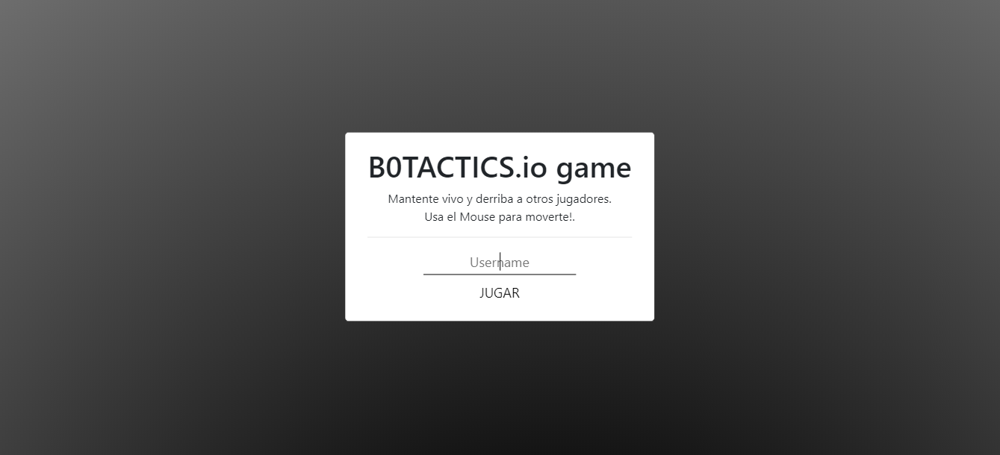
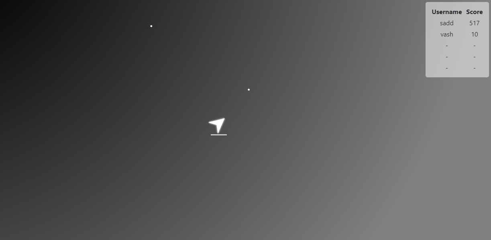

## *juegue!*

+ ## Servidor Basico free AWS
http://54.167.73.186:8080/

+ ## Servidor Con mas potencia en AZURE
http://13.92.95.224:8080/

## ¿ Qué necesidad cubre nuestro producto ?
cubre una necesidad de Entretenimiento en la industria de videojuegos que cada dia es mas demandada.

## ¿ Cual es nuestra idea de negocio ?

   * ### terminos academicos:
       + Ofrecerla a nuestros compañeros del b0 un medio de entretenimiento.
   * ### terminos de negocio:
       * Utilizaremos el modelo de negocio "cebo y anzuelo" para generar ganancia a futuro                  ofreciendo desde el principio un juego optimo          y de calidad con pequeñas                    microtransacciones para "desbloquear" mejoras.

 
## Nicho de Mercado
* **a usuarios niños y adolescentes que son apasionados por los videojuegos o simplemente buscan un momento de distracción donde puedan desarrollar inconscientemente habilidades como:**

    * Competitividad
    * Trabajo en Equipo ( modo equipos )
    
* **Tipos de Jugadore que podremos tener**

    * Achievers (Conquistadores) su objetivo es resolver retos y recibir recompensas por ello.
    * Explorers (Exploradores) Quieren conocer y descubrir todo lo que el juego tenga para ofrecer.
    * Socializers (Socializadores) La experiencia, la comunidad es lo que realmente les motiva a         estar en el juego.
    * Killers (Asesinos) Los que buscan competir y sobresalir, los que disfrutan venciendo, si no aplastando a los demás.
    

## Descripción
_B0Tactics.io es una adaptación de los juegos de extensión .io la mecánica de estos juegos consiste en un grupo de jugadores que compiten para llegar al primer lugar obteniendo la mayor cantidad de puntos, estos juegos no tienen una victoria definida clara.
#
El proyecto consiste en que cada jugador controla un Personaje , este personaje se desplazara por el mapa consumiendo puntos que lo ayudaran a crecer de tamaño y competir contra los otros jugadores, la meta es aumentar el tamaño del personaje, y mantenerse en la cima de putuaciones.
#
Al iniciar el juego el usuario aparece con un personaje de un tamaño predeterminado pequeño y sin puntos. En el mapa apareceran pequeños puntos que seran consumibles por el jugador y le permitiran aumentar sus puntos y su tamaño, adicional a esto se pueden conseguir puntos consumiendo a otro jugador, esta sera la manera mas efectiva de aumentar el tamaño  pero tambien la mas arriesgada ya que al haber un enfrentamiento el personaje de menor tamaño resultara perdedor.El jugador tambien dispondra de la posibilidad de obtencion de pequeñas ayudas temporales que apareceran de forma aleatoria en el mapa.

## Historias de usuario
* **Historias Colaborativas :**
   * Consumir jugador
   * Conseguir Poderes
   * Conseguir puntos
* **Historias no Colaborativas :**
   * Registro
   * Login
   * Agregar skin
   * Unirse a partida
   * Records

_las historias de usuario estarán disponibles en el siguiente link:_
https://tree.taiga.io/project/nicolaspatino-b0tacticsio/backlog

## Diagrama Arquitectura General

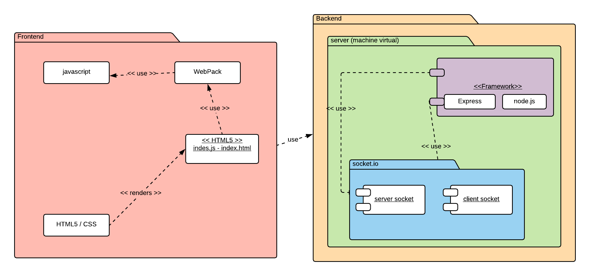

## Diagrama caso de uso usuario

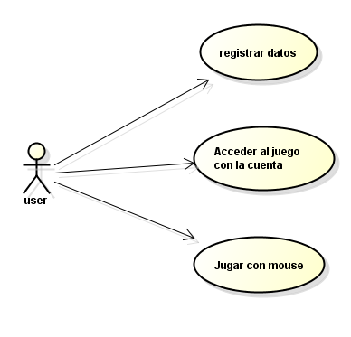

## Diagrama de despliegue

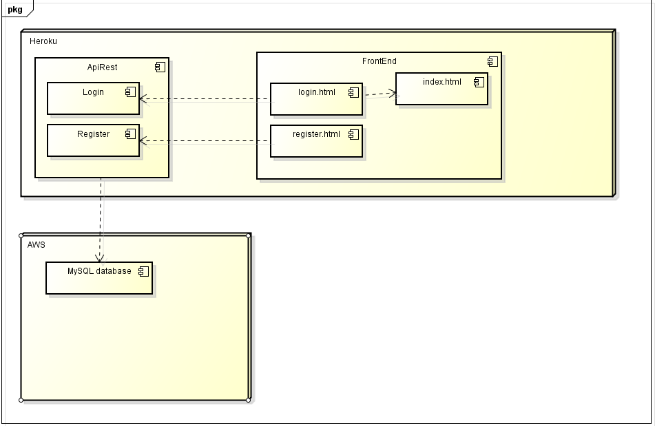

# **Atributos No Funcionales**

* # **Usabilidad**
    + **se puede jugar desde cualquier dispositivo (pc, tablet, celular)**

    

    Se hizo la prueba desde la aplicacion web "http://responsive-design.active-value.de/" alli se       puede simular nuesra aplicacion sobre distintos tamaños de dispositivos.

    video:
    https://youtu.be/euKZh0vArDY

    

* # **Escalabilidad Vertical con AWS**
    * **Información de la maquina**
    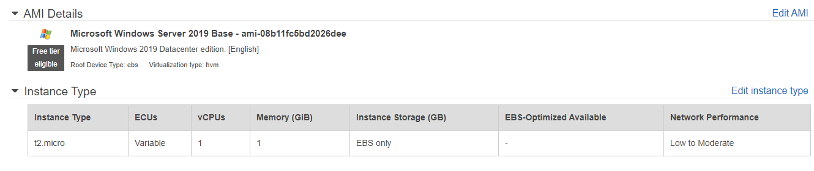

    * **Prueba de Rendimiento con +30 personas jugando**

    como se puede observar simplemente lo maximo que se utilizo en la cpu fue un 2.98% porciento en     ese lapso de tiempo donde estuvieron la mayoria de personas jugando, esto da como evidencia el     buen performance en la maquina mas simple de AWS
    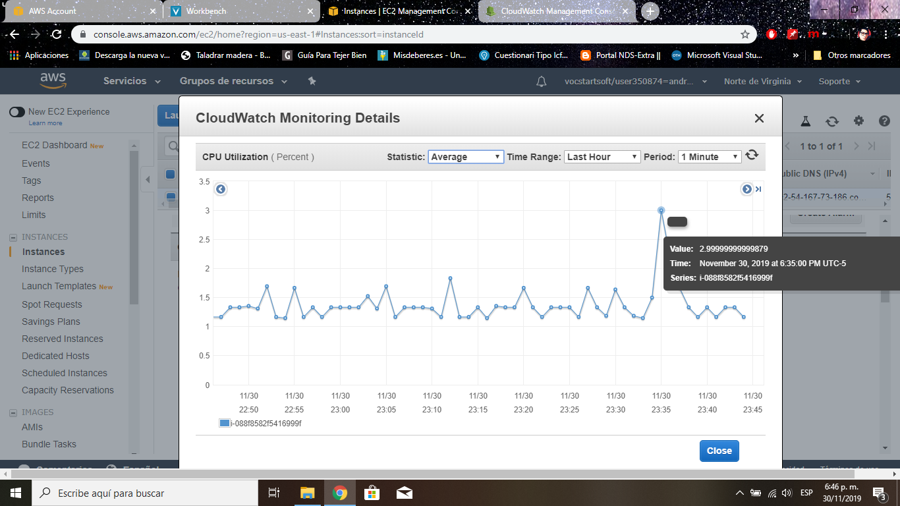

    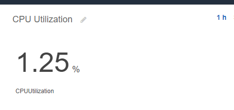

    en conclusion usando la maquina de AWS mas basica que es la free, logramos un Rendimiento           increible asi que si se llegara a usar una maquina mas avanzada el proyecto puede crecer           viablemente con nuevas funcionalidades.

* # **Disponibilidad con AWS**

    * Manejamos una instancia EC2 en windows con amazon web services que garantiza que tengamos una       operabilidad del 99% de nuestro servidor las 24h del dia.

    

* # **Rendimiento (Performance)**

    * **Almacenamiento en cache**
        Entonces, estamos usando webpack para agrupar nuestra aplicación modular que produce un             /dist directorio desplegable . Una vez que el contenido de /dist se haya implementado en un         servidor, los clientes (generalmente los navegadores) accederán a ese servidor para                 capturar el sitio y sus activos facilmente.
    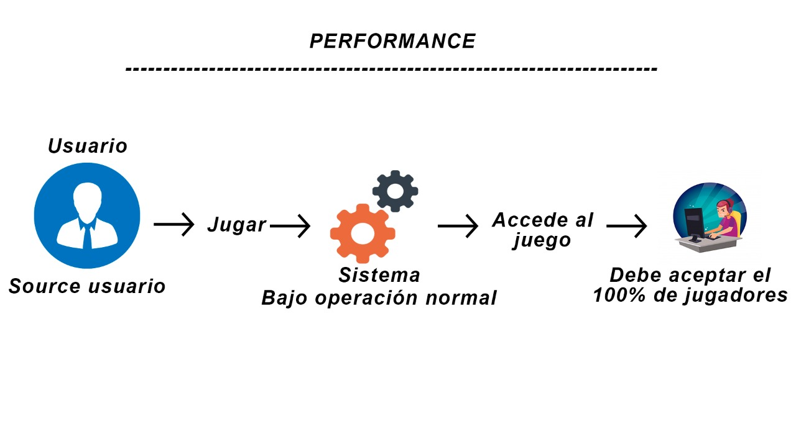
    
    * **Latencia de 100ms**
        utilizar un retraso de renderizado de 100 ms, lo que significa que el estado del cliente           "actual" siempre estará 100 ms por detrás del estado del juego del servidor. Por ejemplo,           si el servidor está en el momento 150 , el estado representado en el cliente será el estado         del servidor en el momento 50 :
        
        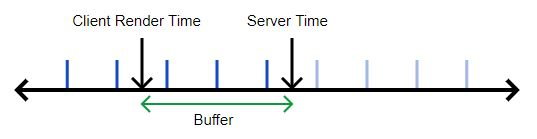

        Esto nos da un búfer de 100 ms para tolerar llegadas impredecibles de actualizaciones del           juego:

        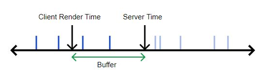

        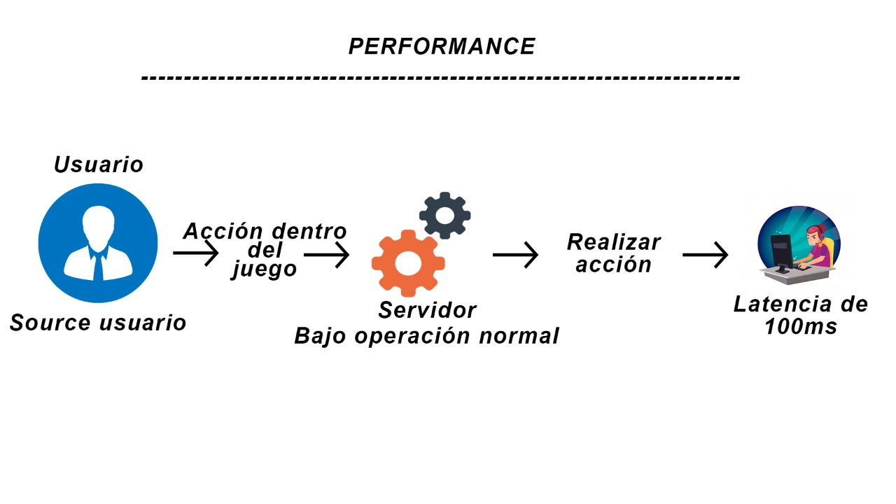

    * **Interpolación Lineal**
        La otra mejora que haremos es usar interpolación lineal. Debido a la demora en el                   procesamiento, generalmente ya tendremos al menos 1 actualización antes de la hora actual           del cliente. Cada vez que se llama, podemos interpolar linealmente entre las                       actualizaciones del juego inmediatamente antes y después del tiempo actual del cliente:

        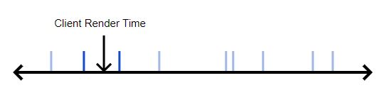

        Esto resuelve nuestro problema de velocidad de cuadros: ¡ahora podemos renderizar cuadros           únicos con la frecuencia que queramos!
    
* # **Seguridad**
    * **Servidor EC2 (windows)**:
        * Grupo de seguridad habilitando solamente los puertos que usaremos en nuestra aplicación

        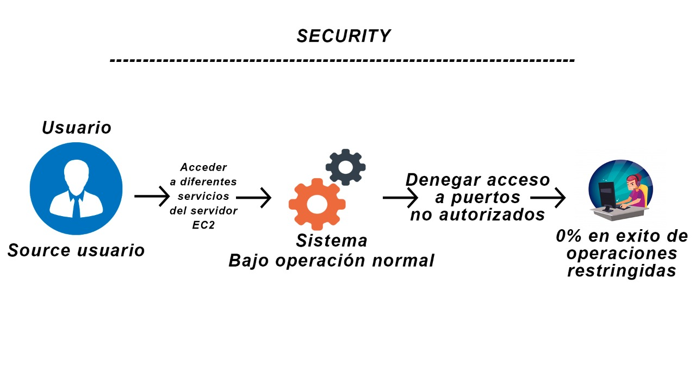

        * snapshots diarios que seran nuestro backup del servicio

## Software posiblemente a usar para la iniciacion del proyecto.

   * ### express:
       * Express.js es un framework para Node.js que sirve para ayudarnos a crear aplicaciones web en menos tiempo ya que nos
       proporciona funcionalidades como el  enrutamiento, opciones para gestionar sesiones y cookies, etc...
       
   * ### socket.io:
       * es una librería que nos permite manejar eventos en tiempo real mediante una conexión TCP y todo ello en JavaScript. Es
       realmente potente y podremos hacer que el real time en nuetra aplicacion sea realmente optimo.

## *Manual de Usuario*
      
https://github.com/B0Tactics/proyecto/blob/master/img/Manual%20de%20usuario.pdf

